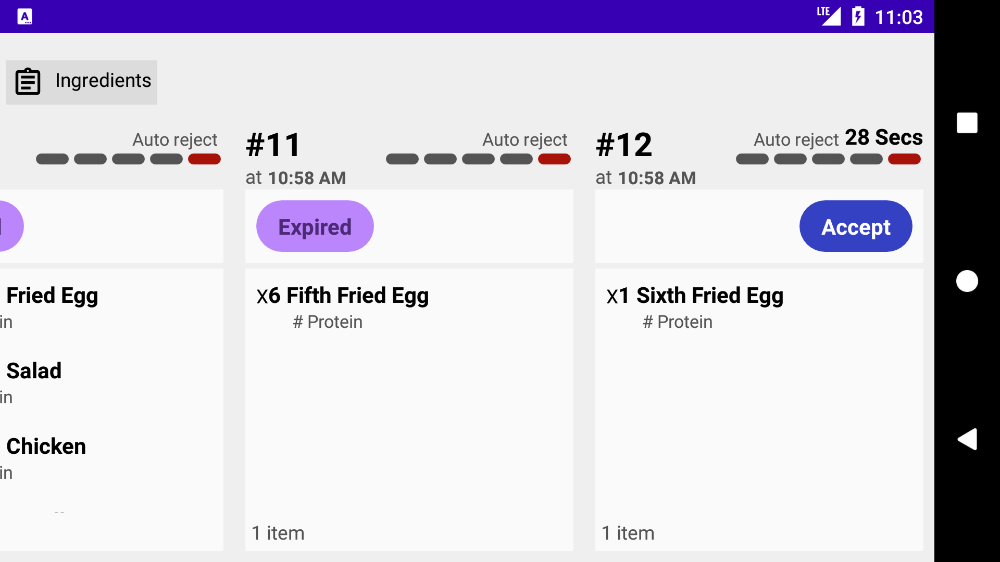
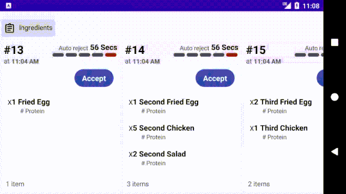
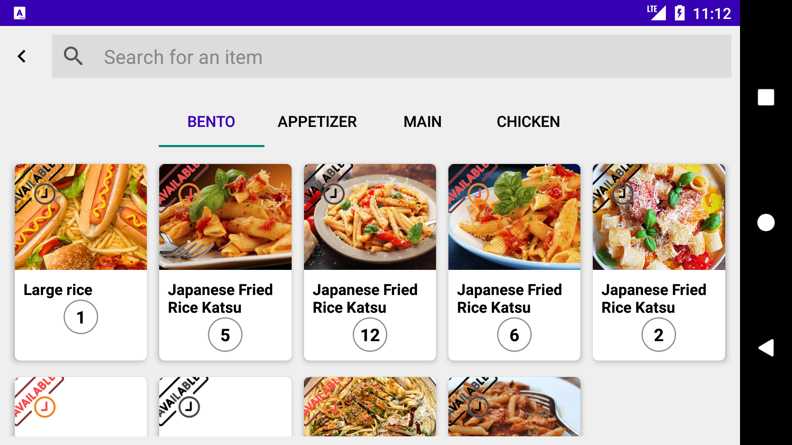

# LifeCycle aware objects
## My personal project to practice some advanced topics around a problem regarding threads and timers in android. LifecycleAware views are used here as a possible solution to the issue.

### Story
OK, No fancy stuff, Here we have a simple merchant application to display new orders to the restaurant/teller/management to `Accept` (process) or `Reject` (refuse).
 Every order has a timeout(Countdown timer) period and is displayed on it. When the timer finishes the order is rejected automatically.
 We have a second page to search some dummy ingredients. It's made to demonstrate lifecycle change and test system stability.

### Issue
We will have many orders. Each order comes with a timer in it. Timers need to be managed wisely in order to avoid thread and resource consumption problems.

### Technologies
`Architecture`: MVVM
`Database`: Room
`DI`: Dagger2
`Thread system`: RxJava
`Network`: Retrofit
`Other`: KotlinDsl, DataBinding, LiveData, CustomView, Jetpack Nav,..

### Notes
OK then, I've handled the issue with lifecycleAware views combined with RecyclerView.

* Mock data is fetched throughout an Interceptor. It returns a list of orders with a 5 min expiration period.
* Single source of truth is implemented(Orders are stored in DB > Repos fetch them from DB)
* Thread management is happening in [CountdownRunnerView.kt] which is lifecycleAware component.
* View states are handled in such a way to consume lowest possible resources.
* Kotlin DSL enabled.
* Worth to note that: The whole process would be quite simpler and cleaner if we could use Kotlin Coroutines.

And, feel free to let me know if something can be improved or even put your hands in the shit and post a pull request.
That's it. Thanks for reading.